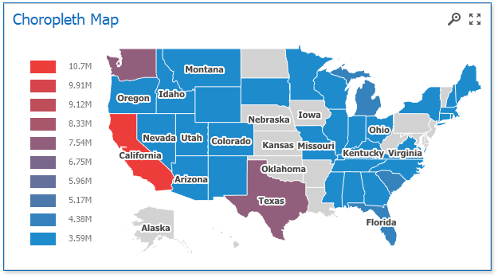

<!-- default badges list -->

<!-- default badges end -->

# Dashboard for WinForms - Provide Custom Maps for Map Dashboard Items in code

The following example shows how to load a .shp file to provide a custom map for the Choropleth Map dashboard item.

DevExpress Dashboard uses a **Shapefile** vector format to provide custom maps. Commonly, this format includes two file types:

- **.shp** file - holds map shapes (points/lines/polygons);
- **.dbf** file - contains attributes for each shape.

Follow the steps below to load the existing shapefile in code:

- Set the [MapDashboardItem.Area](https://docs.devexpress.com/Dashboard/DevExpress.DashboardCommon.MapDashboardItem.Area) property to **Custom** and use the [MapDashboardItem.CustomShapefile](https://docs.devexpress.com/Dashboard/DevExpress.DashboardCommon.MapDashboardItem.CustomShapefile) property.
- Create a [CustomShapefileData](https://docs.devexpress.com/Dashboard/DevExpress.DashboardCommon.CustomShapefileData) object.
- Specify its [CustomShapefileData.ShapeData](https://docs.devexpress.com/Dashboard/DevExpress.DashboardCommon.CustomShapefileData.ShapeData) property and [CustomShapefileData.AttributeData](https://docs.devexpress.com/Dashboard/DevExpress.DashboardCommon.CustomShapefileData.AttributeData) property (optional).
- Assign this object to the [CustomShapefile.Data](https://docs.devexpress.com/Dashboard/DevExpress.DashboardCommon.CustomShapefile.Data) property.

If you use the [CustomShapefile.Url](https://docs.devexpress.com/Dashboard/DevExpress.DashboardCommon.CustomShapefile.Url) property to open a map, the dashboard XML definition will contain the path to a map shapefile. If you open the map with the [CustomShapefile.Data](https://docs.devexpress.com/Dashboard/DevExpress.DashboardCommon.CustomShapefile.Data) property, the dashboard XML definition will contain the map itself.

## Files to Review

* [Form1.cs](./CS/WindowsFormsMapCustomShape/Form1.cs) (VB: [Form1.vb](./VB/WindowsFormsMapCustomShape/Form1.vb))

## Documentation

- [Choropleth Map](https://docs.devexpress.com/Dashboard/16487)
- [Geo Point Maps](https://docs.devexpress.com/Dashboard/16505)
- [Providing Maps](https://docs.devexpress.com/Dashboard/16478)
- [Custom Maps](https://docs.devexpress.com/Dashboard/16478/winforms-dashboard/winforms-designer/create-dashboards-in-the-winforms-designer/dashboard-item-settings/choropleth-map/providing-maps#custom-maps)

## More Examples

- [Dashboard for WinForms - Customize Map Item Popup Menu to Load Shape Files](https://github.com/DevExpress-Examples/dashboard-designer-how-to-import-shape-files-into-map-items-using-openfiledialog-t567206)
- [Dashboard for WinForms - Bind a Choropleth Map Dashboard Item to Data at Runtime](https://github.com/DevExpress-Examples/how-to-bind-a-choropleth-map-dashboard-item-to-data-in-code-e5010)
- [Dashboard for WinForms - Bind a Pie Map Dashboard Item to Data in code](https://github.com/DevExpress-Examples/how-to-bind-a-pie-map-dashboard-item-to-data-in-code-t119627)
- [Dashboard for WinForms - Bind a Bubble Map Dashboard Item to Data in code](https://github.com/DevExpress-Examples/how-to-bind-a-bubble-map-dashboard-item-to-data-and-customize-its-palette-t119682)
- [Dashboard for WinForms - Bind a Geo Point Map Dashboard Item to Data at Runtime](https://github.com/DevExpress-Examples/how-to-bind-a-geo-point-map-dashboard-item-to-data-in-code-e5036)
